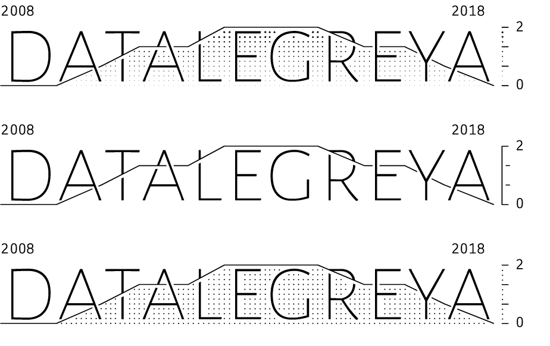

<!-- README.md is generated from README.Rmd. Please edit that file -->

# datalegreyar

The datalegreyar package aims to make formatting of data for use with
the [Datalegreya font](http://figs-lab.com/datalegreya) very easy. The
font can be downloaded from
[Github](https://github.com/figs-lab/datalegreya)

## Installation

`datalegreyar` is not on CRAN yet. It can be installed from this Github
repo.

``` r
devtools::install_github("emiltb/datalegreyar")
```

## Example

Currently the package only export one function: `da_format`. It takes a
dataframe with specification of two columns, and a text string and
outputs the string that plots the data with the `datalegreya` font.

``` r
library(datalegreyar)
data <- data.frame(year = seq(2008, 2018, 1), val = 2 * sin(seq(0, pi, length.out = 11)))
text <- "datalegreya"
result <- da_format(data, year, val, text, xlab = TRUE, ylab = TRUE)

result
#> {2008 }d|0a|1t|2a|2l|3e|3g|3r|2e|2y|1a|0{2018 }[2    [0    ]
```

When this string is written with the Detalegreya font, it looks like
below. There are three variants of the font (gradient, thin, dot) all
illustrated here.


